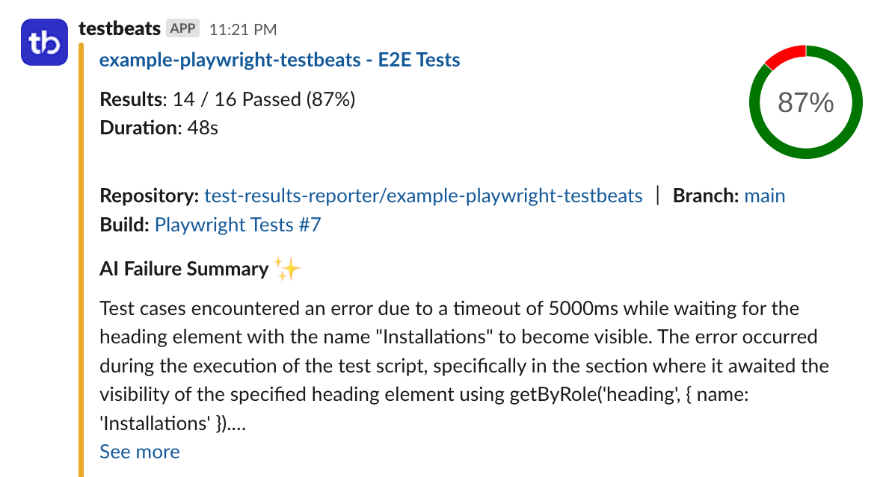
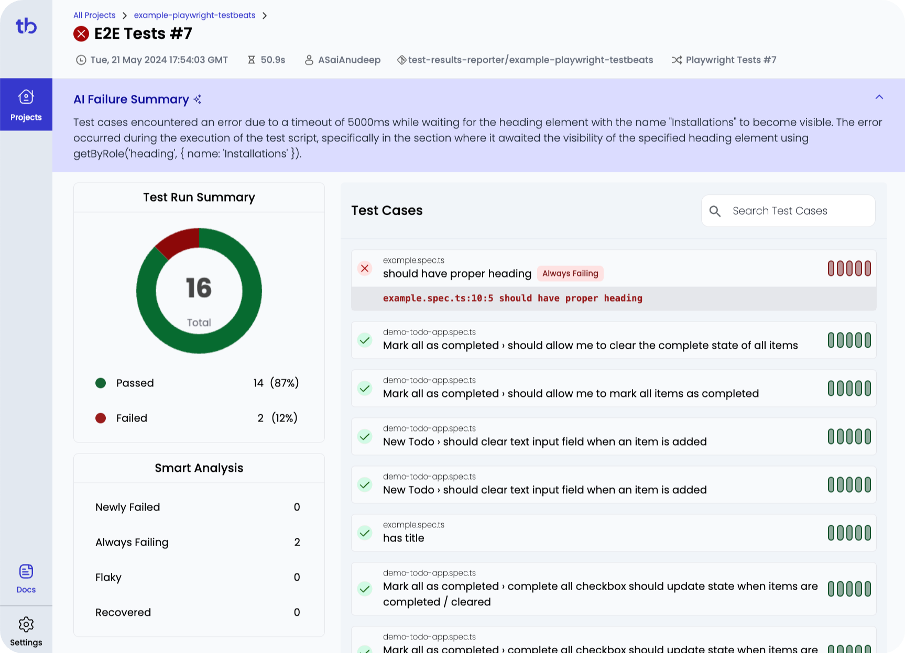

> This npm package has been renamed from [test-results-reporter](https://www.npmjs.com/package/test-results-reporter) to [testbeats](https://www.npmjs.com/package/testbeats). test-results-reporter will soon be phased out, and users are encouraged to transition to testbeats.

#### Publish test results to Microsoft Teams, Google Chat, Slack and many more.

 

### Get Started

TestBeats is a tool designed to streamline the process of publishing test results from various automation testing frameworks to communication platforms like **slack**, **teams** and more for easy access and collaboration. It unifies your test reporting to build quality insights and make faster decisions.

Read more about the project at [https://testbeats.com](https://testbeats.com)

### Sample Reports

#### Alerts in Slack

#### Results in Portal

 

## Need Help

We use [Github Discussions](https://github.com/test-results-reporter/testbeats/discussions) to receive feedback, discuss ideas & answer questions. Head over to it and feel free to start a discussion. We are always happy to help 😊.

## Support Us

Like this project! Star it on [Github](https://github.com/test-results-reporter/testbeats) ⭐. Your support means a lot to us.