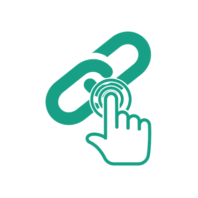

## Test Results Reporter

#### Publish test results to Microsoft Teams, Google Chat, Slack and many more.

 

### Targets

  

### Extensions

   

### Test Results

     

## Sample Reports

 

 

# [Documentation](https://test-results-reporter.github.io/) 

 

## Need Help

We use [Github Discussions](https://github.com/test-results-reporter/reporter/discussions) to receive feedback, discuss ideas & answer questions. Head over to it and feel free to start a discussion. We are always happy to help 😊.

## Support Us

Like this project! Star it on [Github](https://github.com/test-results-reporter/reporter) ⭐. Your support means a lot to us.

<a href="https://www.flaticon.com/free-icons/flask" title="flask icons">Flask icons created by Freepik - Flaticon</a>