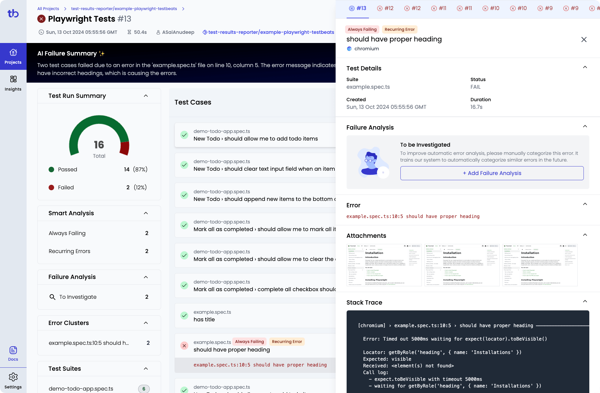

#### Publish test results to Microsoft Teams, Google Chat, Slack and many more.

 

 

**TestBeats** is a tool designed to streamline the process of publishing test results from various automation testing frameworks to communication platforms like **slack**, **teams** and more for easy access and collaboration. It unifies your test reporting to build quality insights and make faster decisions.

It supports all major automation testing frameworks and tools.

Read more about the project at [https://testbeats.com](https://testbeats.com)

### Sample Reports

#### Alerts in Slack

#### Results in Portal

 

> Read more about the project at [https://testbeats.com](https://testbeats.com)

## Need Help

We use [Github Discussions](https://github.com/test-results-reporter/testbeats/discussions) to receive feedback, discuss ideas & answer questions. Head over to it and feel free to start a discussion. We are always happy to help 😊.

## Support Us

Like this project! Star it on [Github](https://github.com/test-results-reporter/testbeats) ⭐. Your support means a lot to us.

 

> Read more about the project at [https://testbeats.com](https://testbeats.com)

## Notes

This npm package has been renamed from [test-results-reporter](https://www.npmjs.com/package/test-results-reporter) to [testbeats](https://www.npmjs.com/package/testbeats). test-results-reporter will soon be phased out, and users are encouraged to transition to testbeats.